# E-commerce-Back-End

## Description

an Ecommerce back end with different DB queries to get data from or update to the database

## Table of Contents

- [Installation](#installation)
- [Usage](#usage)
- [License](#license)
- [Contribution](#contribution)
- [Test](#test)
- [Further Questions](#furtherquestions)

## Installation

Open the directory from VS Code.

1. go to the db directory, use $mysql -u root -p  to longin, then construct the db structure source schema.sql

2. seed the database by going to the seeds directory, enter command $node index.js

3. go back to the root directory, install using $npm install

4. start the app by $npm start

## Usage

1. Use insomnia to process category data, get all data, get one data, create, update & delete:

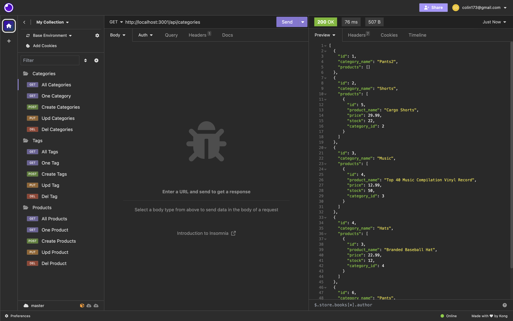  
  
  
  
  

2. Use insomnia to process tag data, get all data, get one data, create, update & delete:

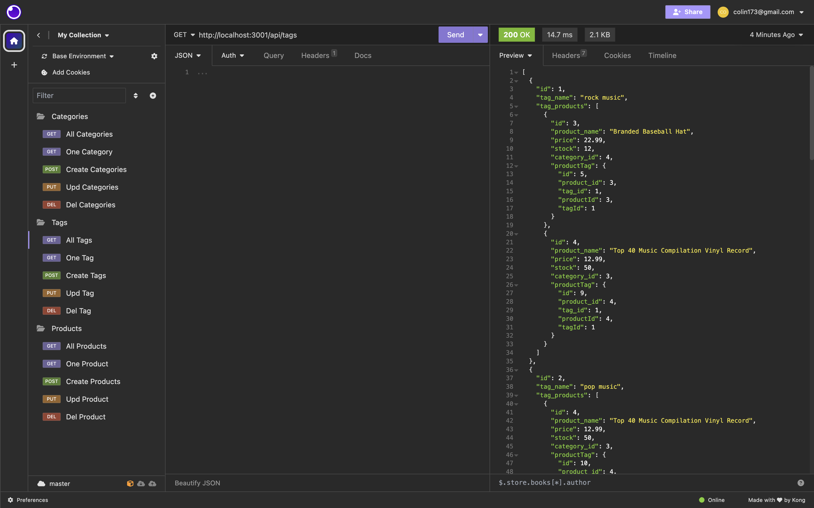  
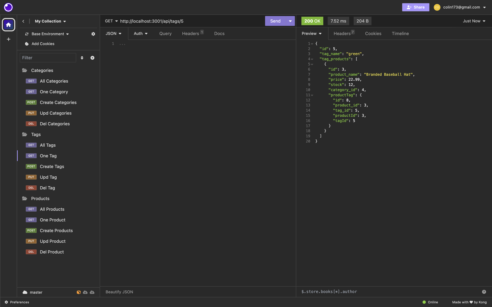  
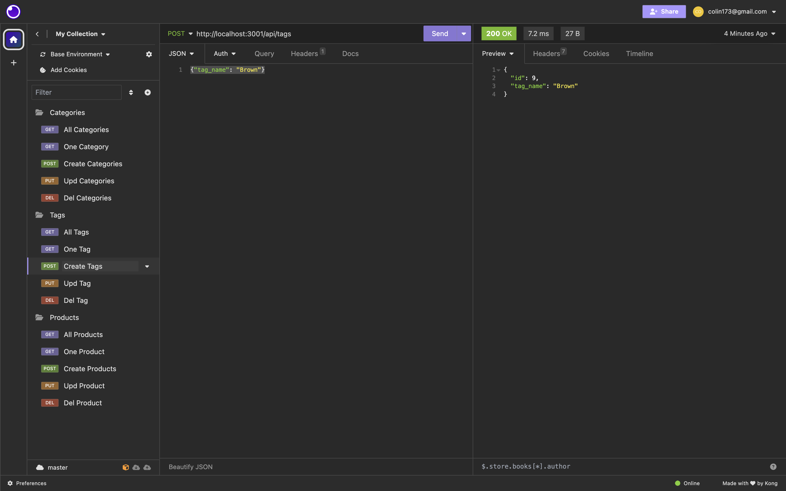  
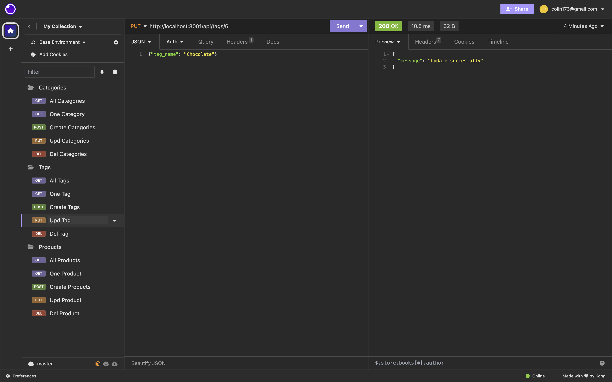  
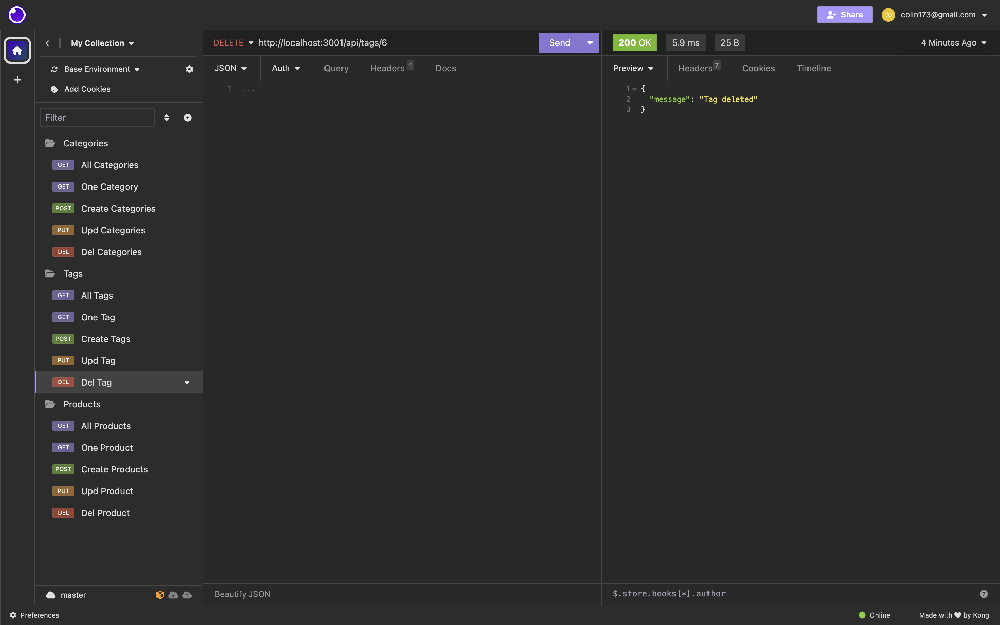  

3. Use insomnia to process product data, get all data, get one data, create, update & delete:

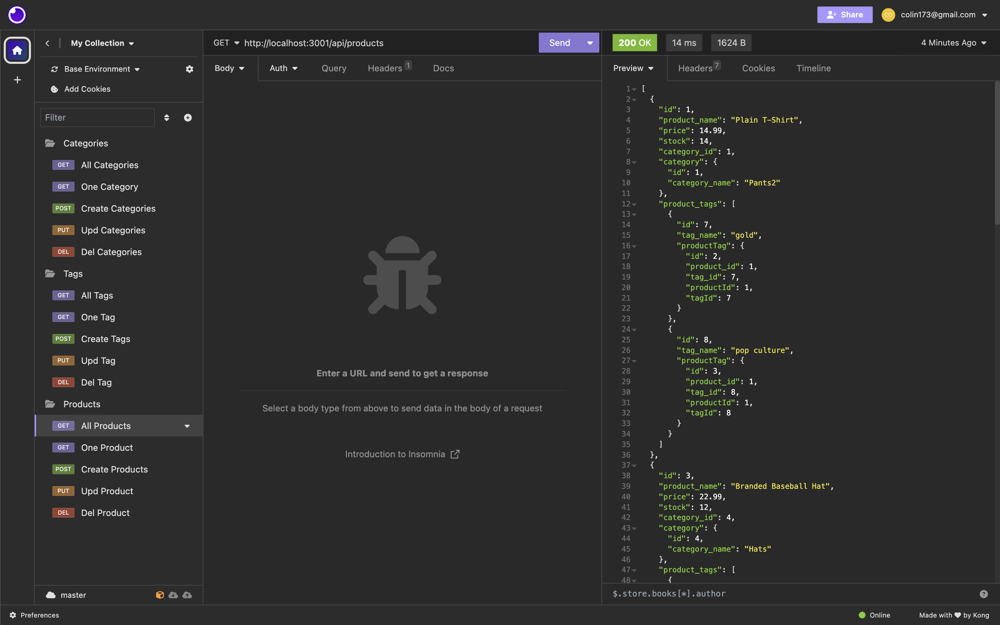  
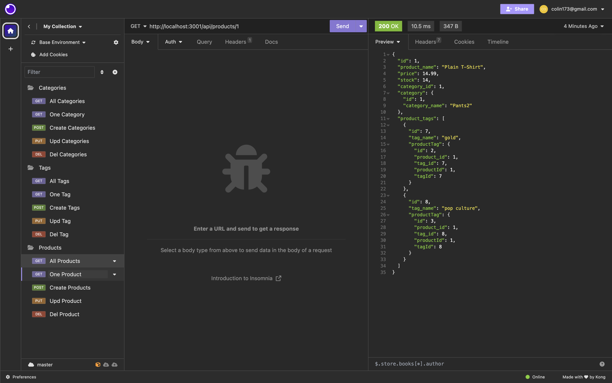  
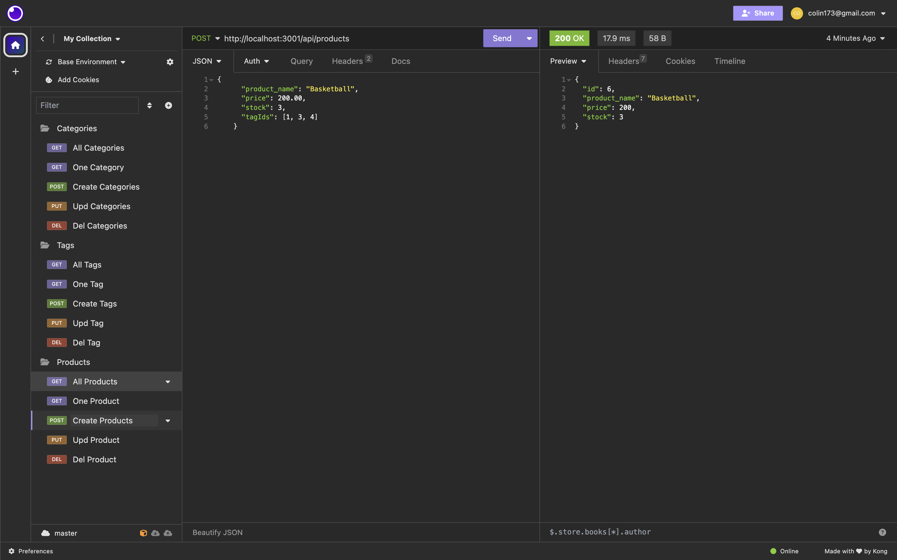  
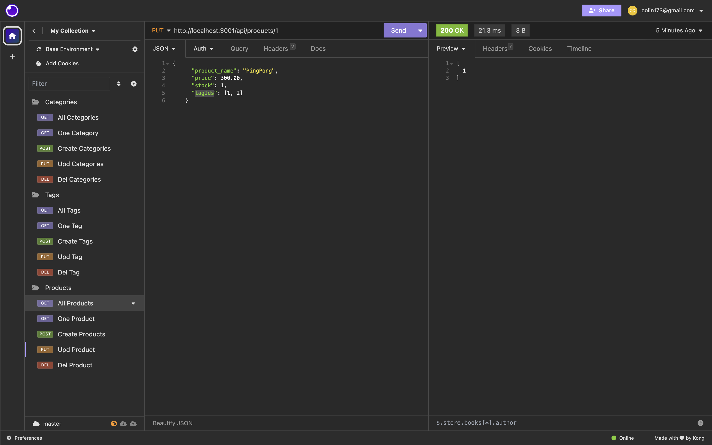  
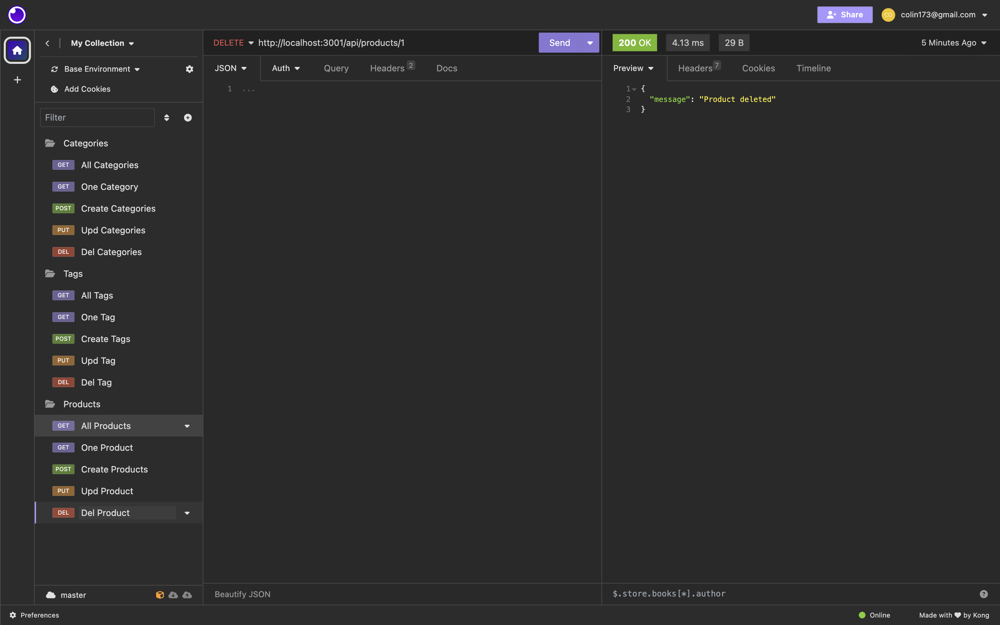  

6. here is the video walk through of the installation & query:
https://drive.google.com/file/d/1dCxQlXMavUHj8kTQiVVKUNpw8TyaJLJD/view

## License

N/A

## Contribution
You can contribute to this application by revising the codes here:  
https://github.com/mkdkck/E-commerce-Back-End

## Test
N/A

## FurtherQuestions

please review the codes here：  
https://github.com/mkdkck/E-commerce-Back-End

or contact the owner via: colin173@gmail.com

## Badges

